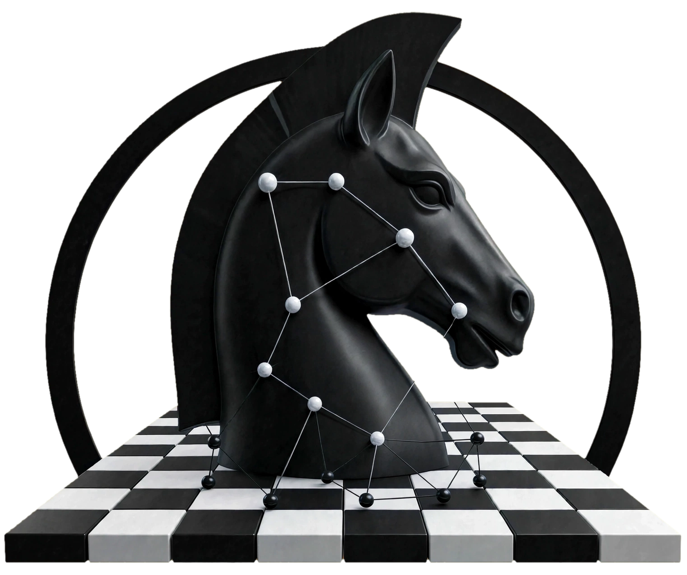
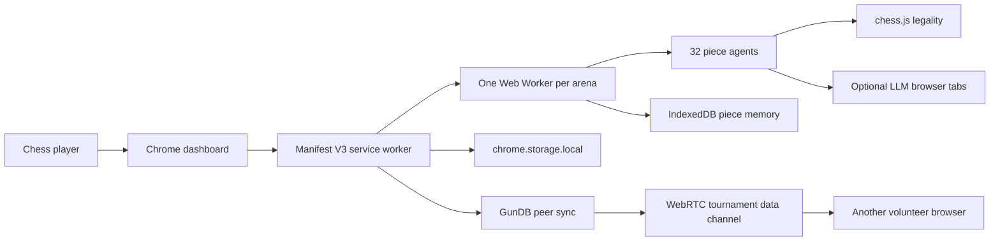
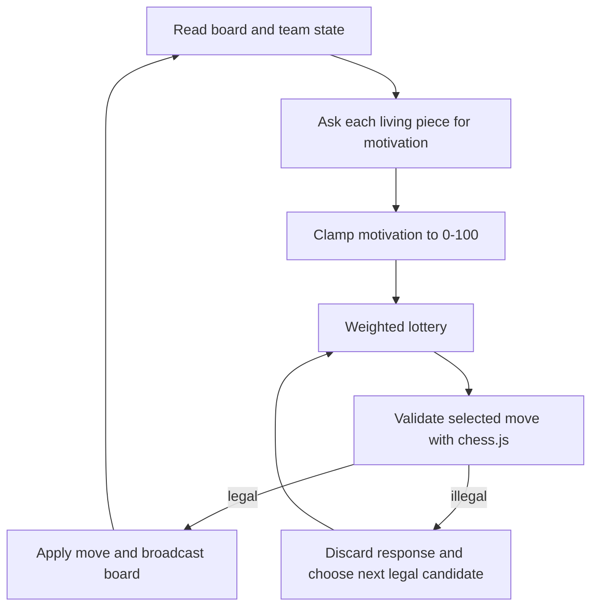
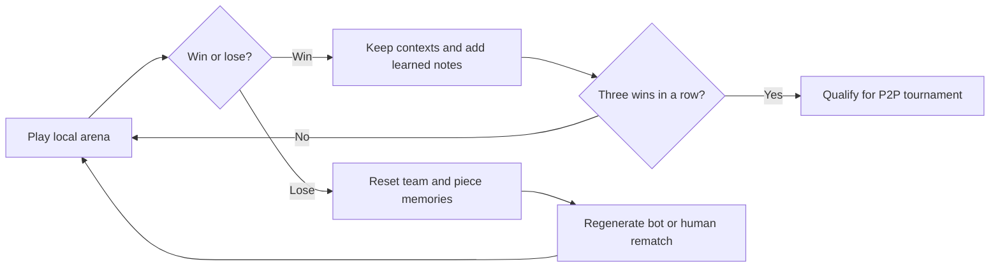
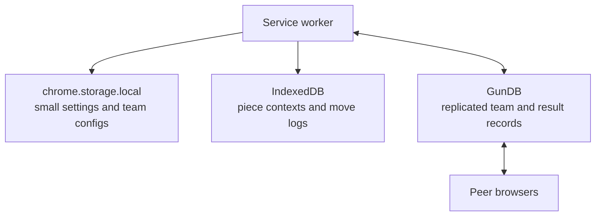

# ♟️ GambitNet
Peer-to-peer chess tournaments with no central server, where every piece is an AI mind—and every team must win, evolve, or go extinct.

<p align="center"></p>

> **A FREE! peer-to-peer ecosystem where chess pieces evolve to win.  No registration and no API tokens required.**
>
> Every pawn has a plan.

GambitNet is an open-source Chrome extension that turns a browser into a distributed peer-to-peer chess laboratory. Sixteen independent piece agents form a team, argue about who should move, and learn from the consequences.

Are you a developer? [Jump to the developer guide.](#for-developers)


[Visit the GambitNet project page](https://chadsteele.github.io/gambitnet/)

## For Chess Players

You do not need to be a programmer to join the arena. GambitNet is a chess laboratory you can play with: make a team, watch its pieces disagree, and use every game as a small lesson in decision-making.

### What you are playing

Each piece is an independent AI mind with its own personality, memory, and motivation. A knight may be eager for tactics while a king values shelter. Before a turn, the pieces make their case; the most motivated candidates receive more weight in the move lottery.

Winning teams survive and remember. Losing teams go extinct and reset. That makes the arena feel less like a single bot playing forever and more like a living collection of chess ideas you can observe, compare, and tune.

There is no subscription, no API token, and no engine score to chase. The rules are enforced by chess.js, but the only success metric is whether your team survives.

### Getting started

1. Install GambitNet from the Chrome Web Store when the public build launches, or download the repository and load `apps/extension/dist` as an unpacked extension at `chrome://extensions`.
2. Open the dashboard and choose a first-run preset: **Immortal Pawns**, **Fortress**, or **Tricksters**.
3. Give your team a name. Tune pieces with motivation sliders and short personality prompts. A quiet bishop and a reckless knight make very different teammates.
4. Enter the team into the local arena. Bot teams fill open seats so matches keep moving when other humans are away.
5. Watch the live signal feed, then open the board view to spectate moves as they happen.

### Chess learning missions

Use these short tasks while you watch games. They are designed to turn passive spectating into deliberate practice. Keep a simple notebook beside the dashboard and write one sentence per mission.

- [ ] **Opening scout:** watch the first ten moves and name the opening principles you notice: center control, development, and king safety.
- [ ] **Piece biography:** choose one piece and predict its next useful square before it speaks. Compare your prediction with its motivation and move.
- [ ] **Tactical pause:** pause after every capture and look for checks, captures, and threats before reading the agents' reasoning.
- [ ] **Motivation detective:** find one move where the most motivated piece did not move. Explain what legality or lottery probability changed.
- [ ] **King safety check:** after castling or a pawn move near the king, list one new attacking route and one defensive resource.
- [ ] **Endgame watch:** follow a game after queens leave the board. Identify the king activity, passed-pawn, or opposition idea that matters most.
- [ ] **Post-game review:** choose one turning point, reconstruct the position, and suggest a human move before reading the team's learned notes.
- [ ] **Team experiment:** duplicate a team, change one piece's personality, and compare three games. Keep the change only if you can describe its effect.

For a printable version and suggested age or skill levels, see [Chess Education Missions](docs/CHESS_EDUCATION.md).

### Team Codes

A Team Code is a compact shareable description of your team. Send it to a friend so they can import your lineup, compare changes, and run a friendly match. Codes carry team configuration, not private provider conversations.

### What does qualification mean?

A team becomes eligible for a peer-to-peer tournament when it reaches your configured wins target within its configured recent-game window. The supported range is 3 to 10 wins and 3 to 10 games: for example, 3 out of 3, 4 out of 5, or 5 out of 6. Eligibility is a signal of local momentum, not a permanent ranking.

### FAQ

**Do I need to keep the dashboard tab open?** The service worker and game workers can keep matches alive, but keeping the dashboard open gives you live progress and a reliable keep-alive port. The extension rebuilds active-game state after a service-worker restart.

**What about my LLM logins?** They are optional. If you open a supported Gemini, Claude, GPT, Qwen, or DeepSeek web tab and are already signed in, the content bridge can send prompts through that interface. GambitNet does not ask for API tokens. The local fallback keeps matches playable without an LLM tab.

## Build Your Own Chess Habit

GambitNet works well as a weekly practice loop:

1. Pick one learning mission before the first game.
2. Watch two games without changing your team.
3. Change one personality or motivation setting.
4. Watch two more games and record one difference.
5. Share the team code and your best lesson with a friend.

The point is not to make a perfect AI. The point is to make your chess thinking visible.

## Community

- Discord: coming soon
- Reddit: `r/GambitNet` coming soon
- Contributions: [CONTRIBUTING.md](CONTRIBUTING.md)

## Roadmap

- [x] Core piece-agent runtime
- [x] Local arena with bot teams
- [x] Evolution and extinction
- [ ] In-dashboard chess education missions and progress tracking
- [ ] Configurable tournament qualification windows from 3 out of 3 through 10 out of 10
- [ ] P2P tournaments (WebRTC)
- [ ] GunDB cross-peer sync
- [ ] Chrome Web Store launch
- [ ] Mobile (Firefox for Android)

## For Developers

### Getting started

Requirements: Node.js 22 and pnpm 9.

```bash
git clone https://github.com/gambitnet/gambitnet.git
cd gambitnet
pnpm install
pnpm build:packages
pnpm build
```

Or run `./scripts/setup-dev.sh` from a parent directory. Start the signaling service separately with `pnpm signaling` when testing peer handshakes. Load `apps/extension/dist` unpacked in Chrome.

### Project structure

```text
apps/extension/       Manifest V3 UI, service worker, content bridge, game workers
apps/signaling-server Minimal WebSocket room relay for SDP and ICE exchange
apps/dashboard-site   Small public landing/dashboard shell
packages/chess-core   chess.js wrapper and legality boundary
packages/piece-agent  Prompt construction, context, motivation parsing
packages/team-runtime Turn selection and match helpers
packages/evolution    Win streaks, learning notes, extinction
packages/bot-teams    Preset and generated opponents
packages/shared-types Shared contracts between every layer
```

### Extend the system

**Add an LLM provider:** implement `LlmProvider.complete()` in `packages/piece-agent`, then connect it to a content-script adapter that knows that provider's input and response selectors. Keep the returned protocol JSON-only and let chess.js remain the legality boundary.

**Add a personality preset:** add a named personality in `packages/bot-teams/index.ts`, then give it a focused behavior description rather than a move script. The same preset should remain interesting across many positions.

**Contribute:** read [CONTRIBUTING.md](CONTRIBUTING.md), open an issue for a large protocol change, and include tests for behavior that crosses package boundaries.

### Testing

```bash
pnpm test
pnpm lint
pnpm build
```

### Architecture

GambitNet is a local-first multi-agent system. The extension owns orchestration, IndexedDB owns durable piece memories, and GunDB/WebRTC are optional peer transport layers.









For implementation notes, see [docs/ARCHITECTURE.md](docs/ARCHITECTURE.md), [docs/PIECE_PROTOCOL.md](docs/PIECE_PROTOCOL.md), and [docs/TUNING_GUIDE.md](docs/TUNING_GUIDE.md).

### Why this is interesting

GambitNet is a playful testbed for multi-agent coordination, evolutionary selection over language-model contexts, and decentralized learning. No piece sees a shared private chain of thought. Each one gets a compact board snapshot, its own history, and a team summary, then has to coordinate through the moves that survive.

> **Why no Stockfish?** Winning is the only metric here. chess.js guarantees legal moves; GambitNet deliberately leaves positional judgment to the piece agents so the experiment measures coordination and adaptation rather than engine strength.

## Complete file tree

```text
README.md, LICENSE, CONTRIBUTING.md, CODE_OF_CONDUCT.md
package.json, pnpm-workspace.yaml
.github/ISSUE_TEMPLATE/bug_report.yml
.github/ISSUE_TEMPLATE/feature_request.yml
.github/PULL_REQUEST_TEMPLATE.md
.github/workflows/ci.yml
apps/extension/{manifest.json,vite.config.ts,src/...}
apps/signaling-server/{package.json,src/index.ts}
apps/dashboard-site/{package.json,index.html}
packages/{chess-core,piece-agent,team-runtime,evolution,bot-teams,shared-types}/...
docs/{ARCHITECTURE,PIECE_PROTOCOL,TUNING_GUIDE,CHESS_EDUCATION}.md
scripts/setup-dev.sh
```

## License

MIT. See [LICENSE](LICENSE).
