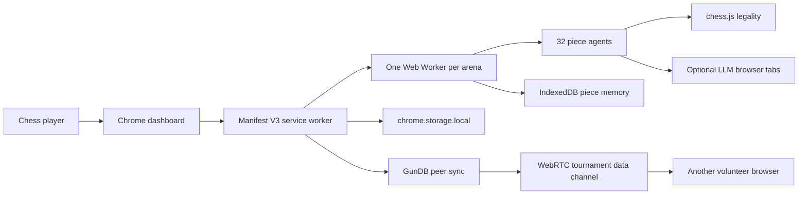
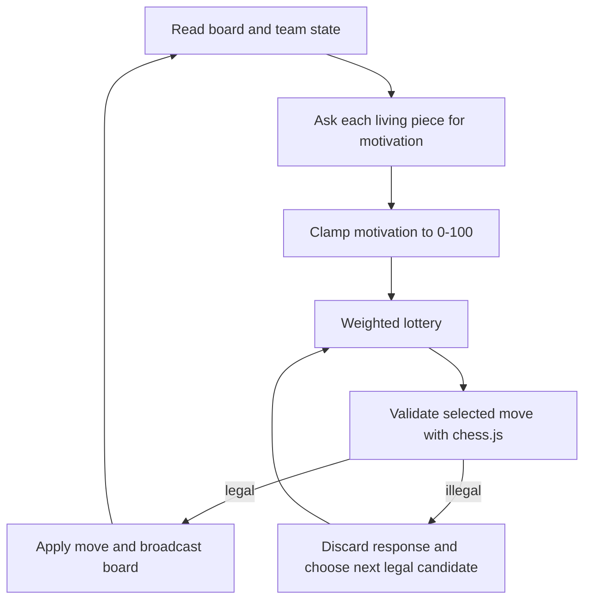
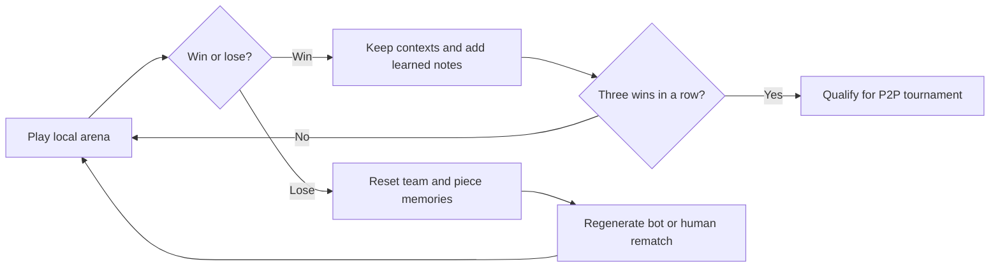
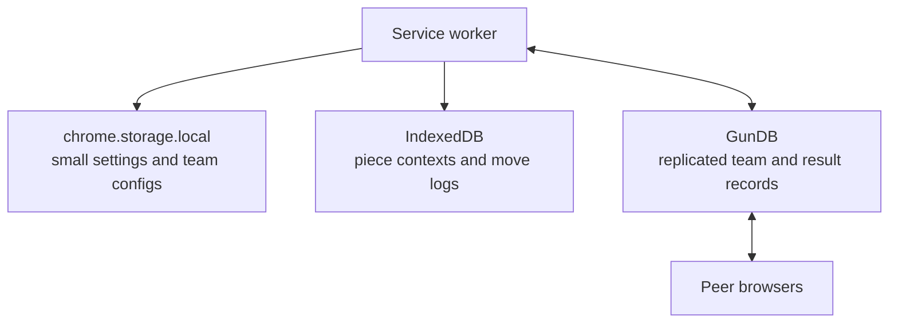

# GambitNet

> **A peer-to-peer ecosystem where chess pieces evolve to win.**
>
> Every pawn has a plan.

GambitNet is an open-source Chrome extension that turns a browser into a distributed chess laboratory. Sixteen independent piece agents form a team, argue about who should move, and learn from the consequences.

[](https://github.com/gambitnet/gambitnet/actions)

## What Is GambitNet?

Each chess piece is its own AI mind with a name, personality, memory, and motivation. Before every turn, pieces assess the position and put themselves forward. A weighted lottery gives more influence to the pieces that feel the moment matters most.

Teams are selected by survival: winning teams keep their contexts and write learned notes; losing teams go extinct and reset. It runs in your browser, uses free web interfaces when you connect them, and does not require API tokens, a central database, or a subscription.

## How It Works

### Architecture



### Turn selection



### Evolution loop



### Storage topology



## Why This Is Interesting

GambitNet is a playful testbed for multi-agent coordination, evolutionary selection over language-model contexts, and decentralized learning. No piece sees a shared private chain of thought. Each one gets a compact board snapshot, its own history, and a team summary, then has to coordinate through the moves that survive.

> **Why no Stockfish?** Winning is the only metric here. chess.js guarantees legal moves; GambitNet deliberately leaves positional judgment to the piece agents so the experiment measures coordination and adaptation rather than engine strength.

## For Chess Players

You do not need to be a programmer to join the arena.

### Getting started

1. Install GambitNet from the Chrome Web Store when the public build launches, or download the repository and load `apps/extension/dist` as an unpacked extension at `chrome://extensions`.
2. Open the dashboard and choose a first-run preset: **Immortal Pawns**, **Fortress**, or **Tricksters**.
3. Give your team a name. Tune pieces with motivation sliders and short personality prompts. A quiet bishop and a reckless knight make very different teammates.
4. Enter the team into the local arena. Bot teams fill open seats so matches keep moving when other humans are away.
5. Watch the live signal feed, then open the board view to spectate moves as they happen.

### Team Codes

A Team Code is a compact shareable description of your team. Send it to a friend so they can import your lineup, compare changes, and run a friendly match. Codes carry team configuration, not private provider conversations.

### What does three wins in a row mean?

A team that wins three consecutive local arena games becomes eligible for a peer-to-peer tournament. Eligibility is a signal of local momentum, not a permanent ranking. One loss resets the streak and sends the team back to the arena.

### FAQ

**Do I need to keep the dashboard tab open?** The service worker and game workers can keep matches alive, but keeping the dashboard open gives you live progress and a reliable keep-alive port. The extension rebuilds active-game state after a service-worker restart.

**What about my LLM logins?** They are optional. If you open a supported Gemini, Claude, GPT, Qwen, or DeepSeek web tab and are already signed in, the content bridge can send prompts through that interface. GambitNet does not ask for API tokens. The local fallback keeps matches playable without an LLM tab.

## For Developers

### Getting started

Requirements: Node.js 22 and pnpm 9.

```bash
git clone https://github.com/gambitnet/gambitnet.git
cd gambitnet
pnpm install
pnpm build:packages
pnpm build
```

Or run `./scripts/setup-dev.sh` from a parent directory. Start the signaling service separately with `pnpm signaling` when testing peer handshakes. Load `apps/extension/dist` unpacked in Chrome.

### Project structure

```text
apps/extension/       Manifest V3 UI, service worker, content bridge, game workers
apps/signaling-server Minimal WebSocket room relay for SDP and ICE exchange
apps/dashboard-site   Small public landing/dashboard shell
packages/chess-core   chess.js wrapper and legality boundary
packages/piece-agent  Prompt construction, context, motivation parsing
packages/team-runtime Turn selection and match helpers
packages/evolution    Win streaks, learning notes, extinction
packages/bot-teams    Preset and generated opponents
packages/shared-types Shared contracts between every layer
benchmarks/           Kaggle-oriented evaluation starter
```

### Extend the system

**Add an LLM provider:** implement `LlmProvider.complete()` in `packages/piece-agent`, then connect it to a content-script adapter that knows that provider's input and response selectors. Keep the returned protocol JSON-only and let chess.js remain the legality boundary.

**Add a personality preset:** add a named personality in `packages/bot-teams/index.ts`, then give it a focused behavior description rather than a move script. The same preset should remain interesting across many positions.

**Contribute:** read [CONTRIBUTING.md](CONTRIBUTING.md), open an issue for a large protocol change, and include tests for behavior that crosses package boundaries.

### Testing

```bash
pnpm test
pnpm lint
pnpm build
```

## Architecture

The main diagrams above show the complete flow. For implementation notes, see [docs/ARCHITECTURE.md](docs/ARCHITECTURE.md), [docs/PIECE_PROTOCOL.md](docs/PIECE_PROTOCOL.md), and [docs/TUNING_GUIDE.md](docs/TUNING_GUIDE.md).

## Roadmap

- [x] Core piece-agent runtime
- [x] Local arena with bot teams
- [x] Evolution and extinction
- [ ] P2P tournaments (WebRTC)
- [ ] GunDB cross-peer sync
- [ ] Kaggle benchmark submission
- [ ] Chrome Web Store launch
- [ ] Mobile (Firefox for Android)

## Kaggle Benchmark

The [benchmark starter](benchmarks/) frames GambitNet as a multi-agent evaluation problem: compare survival, coordination events, and learning across generations. It is a deliberately small harness for reproducible research submissions; see [docs/KAGGLE_SUBMISSION.md](docs/KAGGLE_SUBMISSION.md).

## Community

- Discord: coming soon
- Reddit: `r/GambitNet` coming soon
- Contributions: [CONTRIBUTING.md](CONTRIBUTING.md)

## Complete file tree

```text
README.md, LICENSE, CONTRIBUTING.md, CODE_OF_CONDUCT.md
package.json, pnpm-workspace.yaml
.github/ISSUE_TEMPLATE/bug_report.yml
.github/ISSUE_TEMPLATE/feature_request.yml
.github/PULL_REQUEST_TEMPLATE.md
.github/workflows/ci.yml
apps/extension/{manifest.json,vite.config.ts,src/...}
apps/signaling-server/{package.json,src/index.ts}
apps/dashboard-site/{package.json,index.html}
packages/{chess-core,piece-agent,team-runtime,evolution,bot-teams,shared-types}/...
benchmarks/kaggle-task.py
docs/{ARCHITECTURE,PIECE_PROTOCOL,TUNING_GUIDE,KAGGLE_SUBMISSION}.md
scripts/setup-dev.sh
```

## License

MIT. See [LICENSE](LICENSE).
